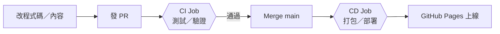

# Launch Your Vibe Coding Product

📖 **[網頁好讀版](https://study2strong.github.io/Launch-Your-Vibe-Coding-Product/)** — 完整內容、逐步拆解、前置條件與限制條件都在這裡

## 這是什麼

Vibe Coding 讓你可以在幾分鐘內跟 AI 一起把一個想法變成看起來能動的網站或 App，但「做出來」只是第一步——它要能被更多人打開、真正開始產生價值，而不是停留在本機或只有你自己的帳號看得到。這個 repo 示範的就是這一段：一個真實跑起來的 CI/CD 流程，把內容從本機變成一個任何人隨時打得開的網址——而且你現在看到的好讀版網頁，就是照著這套流程自動部署出來的。

## 部署流程

完整流程圖、每一步為什麼要做、誰做、實際指令是什麼，都在[好讀版網頁](https://study2strong.github.io/Launch-Your-Vibe-Coding-Product/)裡逐步拆解，這裡只放精簡版：

CI（測試/驗證）與 CD（打包/部署）刻意拆成兩個獨立階段，測試沒過，部署就完全不會被觸發。

`main` 分支已開啟 branch protection：不能直接 push，只能透過 PR 合併，且 PR 必須先通過 CI 的 `test` 檢查——上面這張圖不只是說明文件，是這個 repo 實際強制執行的規則。
