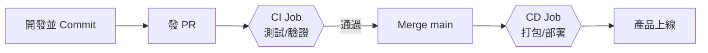

# Launch Your Vibe Coding Product

📖 **[網頁好讀版](https://study2strong.github.io/Launch-Your-Vibe-Coding-Product/)** — 完整流程逐步拆解，該注意的前置條件與限制都寫在對應步驟裡

## 這是什麼

Vibe Coding 讓你可以在幾分鐘內跟 AI 一起把一個想法變成看起來能動的網站或 App，但「做出來」只是第一步——它要能被更多人打開、真正開始產生價值，而不是停留在本機或只有你自己的帳號看得到。

這個 repo 示範的就是這一段：一個真實跑起來的上線流程，把產品從本機變成一個任何人隨時打得開的網頁——而且你現在看到的好讀版網頁，就是照著這套流程自動部署出來的。

## 上線流程

完整流程圖、每一步為什麼要做、對應指令是什麼，都在[好讀版網頁](https://study2strong.github.io/Launch-Your-Vibe-Coding-Product/)裡逐步拆解，這裡只放精簡版：

CI (測試/驗證) 跟 CD (打包/部署) 刻意拆成兩個獨立階段，白話講就是：**修改程式碼/內容後，只要任何一關沒過，這次改動就不會上線**——而且線上原本正常運作的版本也不會被動到，不用擔心一次沒過關的改動，把正在跑的產品弄壞。
