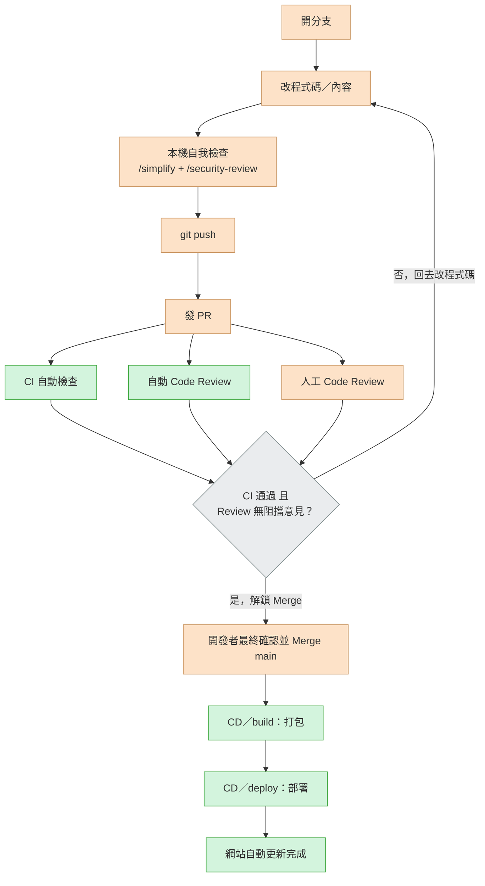

# AI 幫你把產品做出來之後，你要怎麼讓它真正上線？

近年「Vibe Coding」蔚為風潮：打開 AI 工具、描述需求、幾分鐘內就能生出一個看起來能動的網站或 App。這類教學已經多到看不完，但幾乎都停在「程式碼寫出來了、本機跑得動」這一步。

真正的問題其實才剛開始：**這個東西要怎麼變成一個任何人在任何時間、任何裝置都打得開的網址？改壞了怎麼辦？誰來把關品質？下一次改版要怎麼確保不會把上一版弄壞？**

這份筆記記錄的，就是「上線」這一段——用一個真實跑起來的 CI/CD 流程，把「AI 幫你寫出來的東西」變成「隨時可用的產品」。而且這份筆記本身，就是照著這套流程被你現在看到的這個網址部署出來的。

## 為什麼「上線」是 Vibe Coding 教學普遍缺少的一塊

- 大多數教學的終點是「Demo 能動」，但沒有人接手回答「然後呢？」
- 沒有版本控管與審查機制，AI 生成的程式碼一改就是全部重寫，出錯了很難回溯
- 沒有自動化測試，改一個地方壞掉另一個地方，只能靠肉眼巡一遍
- 沒有自動化部署，每次更新都要手動上傳，久了一定會漏做某個步驟

這些問題不是靠「AI 更聰明」就能解決，而是要靠**工程紀律**——也就是 CI/CD。

## CI/CD 核心概念，白話版

- **CI（持續整合，Continuous Integration）**：每次有人提出程式碼改動，自動幫你檢查「這個改動有沒有把東西弄壞」——連結有沒有失效、測試有沒有過。檢查沒過，不准合併。
- **CD（持續部署，Continuous Deployment）**：改動一旦通過檢查、被合併，自動幫你打包、發布上線，不需要手動上傳任何檔案。

重點是這兩件事**要分開**：CI 負責「擋壞掉的東西」，CD 負責「把好的東西送上線」。混在一起做，測試沒過也可能誤觸發部署，這是很多人第一次自己兜 CI/CD 時會踩的坑。

## 這個網站實際採用的部署流程

以下是這個 repo 實際在跑的流程，從動手改一行字開始，到你現在看到的網頁更新為止：

橘色為手動動作，綠色為自動觸發，灰色是決定要不要放行的判斷點。「CI 自動檢查」實際上是連結檢查（lychee）跟 UI 自動化測試（Selenium + pytest）兩項都要過，「CD」對應到 GitHub Actions 裡 `build`（打包）跟 `deploy`（部署）兩個獨立 job——這是刻意跟原本混在一起的單一自動部署節點做出的區隔，其餘實作細節不畫進圖裡，避免流程圖變成架構圖。

這張流程圖不只是說明文件而已：`main` 分支已經開啟 GitHub 的 branch protection，直接 `push` 到 `main` 會被拒絕，只能透過 PR 合併，而且 PR 必須先讓 `test` job 通過才會解鎖 Merge 按鈕——這個限制連 repo 的擁有者（admin）自己都逃不掉。也就是說，這份筆記你現在看到的每一次更新，走的真的就是圖上這條路，不是「畫給人看」的示意。

## AI 輔助開發怎麼嵌進這個流程

這個流程不是「人工開發、AI 只是輔助打字」，而是把 AI 工具嵌進每一個關卡：

- **Plan Mode**：動手改程式碼之前，先讓 AI 提出一份具體的執行計畫並反覆確認方向，避免它自己腦補需求
- **`/simplify`、`/security-review`**：push 之前的本機自我檢查，讓 AI 主動抓多餘的複雜度與安全性問題，而不是等到 PR 階段才被抓包
- **自動 Code Review（如 GitHub Copilot Review）**：PR 開出後自動留下具體建議，與 CI 檢查、人工審查並行進行
- 開發者本身仍然要看得懂架構、能判斷 AI 的建議該不該採納——**AI 加速的是執行速度，不是取代判斷力**

## 這個網頁本身，就是這樣上線的

你現在看到的這個頁面，不是手動上傳到某個地方的靜態檔案，而是這個 repo 的 GitHub Actions 在偵測到 `main` 分支更新後，自動執行 `vitepress build` 打包、再自動部署到 GitHub Pages 產生的結果。想看實際跑過的紀錄，可以直接看 [這個 repo 的 Actions 頁面](https://github.com/Study2Strong/Launch-Your-Vibe-Coding-Product/actions)。

## 下一步規劃（Roadmap）

這個 MVP 目前示範的是「靜態內容」的上線流程。一個真實產品通常還需要下面這些，這裡誠實列出來，作為下一階段要補的能力，而不是假裝已經做完：

- **容器化**：把服務打包成 Docker image，推送到 GitHub Container Registry
- **雲端動態部署**：把上面的 image 部署到三大公雲的容器服務（例如 GCP Cloud Run / Azure Container Apps / AWS App Runner），讓產品具備真正的後端運算能力
- **RESTful／MCP API**：讓產品不只服務瀏覽器使用者，也能讓 AI Agent（例如 Claude）透過 MCP 直接操作
- **資料庫**：從無狀態的靜態內容，進階到有資料持久化需求的服務（RDB／NoSQL）
- **更完整的自動化測試**：從連結檢查、UI smoke test，擴大到單元測試、API 測試、CI 自動化迴歸驗證
