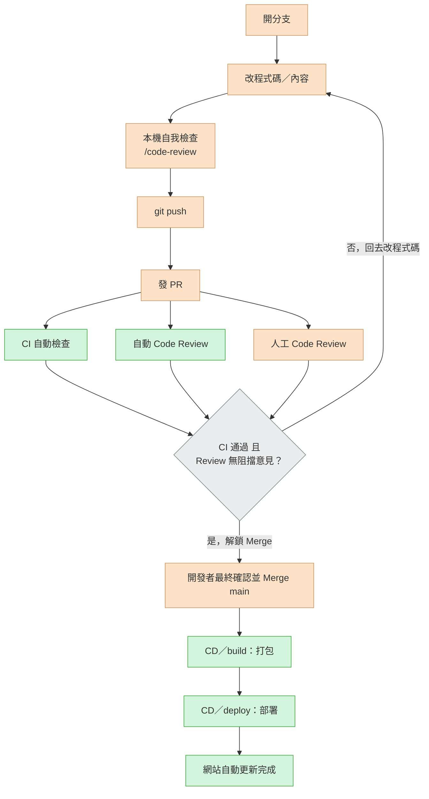

# AI 幫你把產品做出來之後，你要怎麼讓它真正上線？

Vibe Coding 讓你可以在幾分鐘內，跟 AI 一起把一個想法變成看起來能動的網站或 App。但「做出來」只是第一步——它要能被更多人打開、真正開始產生價值，而不是停留在本機或只有你自己的帳號看得到，中間還有一段路要走。

這份筆記記錄的就是這一段：從「本機跑得動」到「任何人在任何時間、任何裝置都打得開、隨時可用」，一個真實在跑的 CI/CD 流程。而且這份筆記本身，就是照著這套流程被你現在看到的這個網址部署出來的。

## 為什麼「上線」這一步不能省

- Demo 能動，不代表任何人都能打開來用——本機跑得動，跟「任何人在任何裝置上都打得開」，中間隔著一段路
- 沒有版本控管與審查機制，一改就是全部重寫，出錯了很難回溯
- 沒有自動化測試，改一個地方壞掉另一個地方，只能靠肉眼巡一遍
- 沒有自動化部署，每次更新都要手動上傳，久了一定會漏做某個步驟

這些問題不是靠「AI 更聰明」就能解決，而是要靠**工程紀律**——也就是 CI/CD。

## CI/CD 核心概念，白話版

- **CI（持續整合，Continuous Integration）**：每次有人提出程式碼改動，自動幫你檢查「這個改動有沒有把東西弄壞」——連結有沒有失效、測試有沒有過。檢查沒過，不准合併。
- **CD（持續部署，Continuous Deployment）**：改動一旦通過檢查、被合併，自動幫你打包、發布上線，不需要手動上傳任何檔案。

重點是這兩件事**要分開**：CI 負責「擋壞掉的東西」，CD 負責「把好的東西送上線」。混在一起做，測試沒過也可能誤觸發部署，這是很多人第一次自己兜 CI/CD 時會踩的坑。

## 這個網站實際採用的部署流程

以下是這個 repo 實際在跑的流程，從動手改一行字開始，到你現在看到的網頁更新為止：



橘色為手動動作，綠色為自動觸發，灰色是決定要不要放行的判斷點。「CI 自動檢查」實際上是連結檢查（lychee）跟 UI 自動化測試（Selenium + pytest）兩項都要過，「CD」對應到 GitHub Actions 裡 `build`（打包）跟 `deploy`（部署）兩個獨立 job——這是刻意跟原本混在一起的單一自動部署節點做出的區隔。

這張流程圖不只是說明文件而已：`main` 分支已經開啟 GitHub 的 branch protection，直接 `push` 到 `main` 會被拒絕，只能透過 PR 合併，而且 PR 必須先讓 `test` job 通過才會解鎖 Merge 按鈕——這個限制連 repo 的擁有者（admin）自己都逃不掉。也就是說，這份筆記你現在看到的每一次更新，走的真的就是圖上這條路。

下面把這張圖的每一步拆開，說明為什麼要做、誰做、實際指令是什麼；有前置條件或限制的地方，就寫在該步驟裡。

## 流程逐步拆解

### 1. 開分支

- **誰做**：手動
- **為什麼**：`main` 已經設定 branch protection，不能直接 push，所有改動都要先有一個獨立的分支
- 前置條件：本機需要先裝好 Git

```bash
git checkout -b <branch-name>
```

### 2. 改程式碼／內容

- **誰做**：手動，可以搭配 AI 輔助——例如先用 Plan Mode 讓 AI 提一份具體計畫、反覆確認方向，再動手改
- **為什麼**：這是整個流程唯一真正「產生內容」的一步，前面開分支、後面所有檢查，都是圍繞著這一步在做把關

### 3. 本機自我檢查

- **誰做**：AI 工具，在本機執行，不上雲端
- **為什麼**：push 之前先自己抓明顯問題，不要等到 PR 階段才被抓包
- 前置條件：本機需要裝好 Node.js + npm（下面的建置指令需要）

先看一次目前實際改了什麼：

```bash
git diff
```

第一次在這個 repo 動手，或是 `package.json` 有變動時，先安裝相依套件：

```bash
npm install
```

跑過這個專案自己的建置指令，確認真的建置得起來：

```bash
npm run docs:build
```

用 Claude Code 做清理與抓 bug，這是 push 前真正把關的一步：

```
/code-review
```

只有這次改動碰到安全性相關內容（權限設定、密鑰、外部輸入等）時，才需要加跑：

```
/security-review
```

### 4. git push

- **誰做**：手動觸發、Git 執行
- **為什麼**：把本機分支同步到 GitHub，後面才有東西可以發 PR
- 前置條件：需要對這個 repo 有推送權限，例如先完成過 `gh auth login` 取得 GitHub CLI 授權

```bash
git push -u origin <branch-name>
```

### 5. 發 PR

- **誰做**：手動，也可以用指令半自動化
- **為什麼**：進入正式合併前的審查與 CI 關卡；因為 `main` 有 branch protection，這是唯一能把改動送進 `main` 的路

```bash
gh pr create --base main --head <branch-name>
```

### 6. CI 自動檢查

- **誰做**：全自動，GitHub Actions 的 `test` job
- **為什麼**：自動擋住明顯壞掉的東西，不用每次都靠人眼巡一遍
- 實際在跑兩項檢查：連結檢查（[lychee-action](https://github.com/lycheeverse/lychee-action)，掃過 README／網頁裡所有連結）、UI 自動化測試（Selenium + pytest，點錨點導覽連結，斷言網址與段落真的對得上）
- 如果想在本機重現 UI 測試：需要 Node.js（建置＋起預覽伺服器）與 Python 3；Selenium 4.6+ 內建 [Selenium Manager](https://www.selenium.dev/documentation/selenium_manager/)，會自動偵測並下載對應版本的 chromedriver，不用手動安裝

### 7. 自動 Code Review

- **誰做**：全自動，GitHub Copilot Review
- **為什麼**：PR 開出後自動留下具體建議，跟 CI 檢查、人工審查並行進行，多一層意見

### 8. 人工 Code Review

- **誰做**：手動
- **為什麼**：AI 的建議該不該採納，最後還是要有人看得懂架構、做判斷——AI 加速的是執行速度，不是取代判斷力

### 9. CI 通過且 Review 無阻擋意見？

- **誰做**：自動判定，GitHub 依 branch protection 規則檢查
- **為什麼**：任何一項沒過，Merge 按鈕就會被鎖住，這是實際擋著的規則，不是口頭約定

### 10. 開發者最終確認並 Merge main

- **誰做**：手動
- **為什麼**：即便 CI 跟 Review 都過了，最後放不放行還是要有人拍板

```bash
gh pr merge --merge
```

### 11. CD／build：打包

- **誰做**：全自動，GitHub Actions 的 `build` job
- **為什麼**：把 Markdown 內容打包成靜態網站檔案；之所以只產出「靜態」檔案，是因為部署目的地 GitHub Pages 只支援純靜態內容，不能執行伺服器端程式、不能直接連資料庫（[來源](https://docs.github.com/en/pages/getting-started-with-github-pages/github-pages-limits)）

```bash
npm run docs:build
```

### 12. CD／deploy：部署

- **誰做**：全自動，GitHub Actions 的 `deploy` job
- **為什麼**：把上一步打包好的內容真正發布上線
- 前置條件：免費方案下 repo 必須設為 **public**，private repo 要 GitHub Pro／Team 付費方案才能搭配 Pages（[來源](https://docs.github.com/get-started/learning-about-github/githubs-products)）
- 限制條件（[來源](https://docs.github.com/en/pages/getting-started-with-github-pages/github-pages-limits)）：網站大小軟上限 1GB；頻寬軟上限 100GB/月；用自訂 GitHub Actions workflow 部署（我們就是這樣做）不受「每小時 10 次」的軟限制；單次部署逾時 10 分鐘；部署內容全部公開可見，不能放密鑰；不可作為商業交易／SaaS 的主要用途

### 13. 網站自動更新完成

你現在看到的這個網址，就是這整條流程跑完的結果。想看實際跑過的紀錄，可以直接看[這個 repo 的 Actions 頁面](https://github.com/Study2Strong/Launch-Your-Vibe-Coding-Product/actions)。

## 下一步規劃（Roadmap）

這個 MVP 目前示範的是「靜態內容」的上線流程。一個真實產品通常還需要下面這些，這裡誠實列出來，作為下一階段要補的能力，而不是假裝已經做完：

- **容器化**：把服務打包成 Docker image，推送到 GitHub Container Registry
- **雲端動態部署**：把上面的 image 部署到三大公雲的容器服務（例如 GCP Cloud Run / Azure Container Apps / AWS App Runner），讓產品具備真正的後端運算能力
- **RESTful／MCP API**：讓產品不只服務瀏覽器使用者，也能讓 AI Agent（例如 Claude）透過 MCP 直接操作
- **資料庫**：從無狀態的靜態內容，進階到有資料持久化需求的服務（RDB／NoSQL）
- **更完整的自動化測試**：從連結檢查、UI smoke test，擴大到單元測試、API 測試、CI 自動化迴歸驗證
